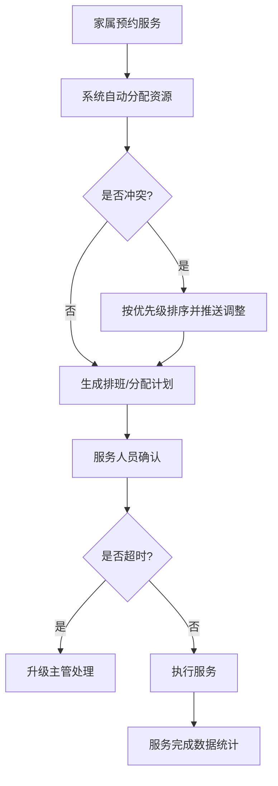

## 1. 产品概述

面向城市殡仪馆的3D交互可视化运营调度平台，通过三维场景直观展示殡仪馆各区域运营状态，实现告别厅、火化车间、骨灰寄存室和调度中心的智能化管理。平台旨在提升殡仪馆运营效率、优化资源配置、降低管理成本，为治丧家属提供更优质的服务体验。

## 2. 核心功能

### 2.1 用户角色

| 角色 | 登录方式 | 核心权限 |
|------|----------|----------|
| 系统管理员 | 账号密码登录 | 全部功能管理、用户管理、数据导出 |
| 调度员 | 账号密码登录 | 厅室分配、服务调度、状态监控 |
| 运营主管 | 账号密码登录 | 审批升级工单、查看统计报表、数据导出 |

### 2.2 功能模块

1. **3D全景总览**：殡仪馆整体三维场景，可切换各区域视角，实时显示各区域状态
2. **告别厅管理**：告别厅3D模型展示、治丧家属信息、仪式进度、剩余时长、智能分配、冲突处理
3. **火化车间监控**：火化炉3D模型、炉温实时监控、累计使用次数、保养倒计时、异常预警
4. **骨灰寄存管理**：格口3D展示、租赁状态、到期提醒、续费通知、超期上锁
5. **治丧服务调度**：司仪/乐队/灵车排班管理、自动分配、超时升级、人员状态
6. **调度中心**：各区域使用率统计、车辆实时位置、全局调度、异常告警
7. **数据统计与导出**：每日服务日报、火化量统计、厅室使用率、满意度统计、Excel导出

### 2.3 页面详情

| 页面名称 | 模块名称 | 功能描述 |
|----------|----------|----------|
| 3D全景总览 | 主场景 | 殡仪馆整体3D模型，支持视角切换、缩放、区域跳转，显示实时数据指标 |
| 3D全景总览 | 数据面板 | 顶部关键指标展示（今日火化量、在厅数、使用率、告警数） |
| 告别厅管理 | 厅室列表 | 告别厅3D模型列表，显示当前状态、治丧家属、仪式进度、剩余时长 |
| 告别厅管理 | 智能分配 | 根据预约时间和规格自动分配最优厅室，冲突时按遗体告别优先排序并推送调整 |
| 火化车间监控 | 炉体监控 | 火化炉实时3D状态，炉温、累计次数、保养倒计时，接近阈值边框变橙，温度异常自动调节并预警 |
| 骨灰寄存管理 | 格口管理 | 格口3D展示，到期前30天橙色闪烁并推送续费通知，超期自动上锁 |
| 治丧服务调度 | 排班面板 | 司仪、乐队、灵车排班管理，根据需求自动排班，超时未确认升级主管 |
| 调度中心 | 全局视图 | 各区域使用率实时更新、车辆位置追踪、全局告警面板 |
| 数据统计 | 报表中心 | 火化量、厅室使用率、满意度统计，支持导出每日服务日报Excel |

## 3. 核心流程

### 3.1 告别厅分配流程
治丧家属预约告别服务，系统根据预约时间、厅室规格自动匹配最优厅室。若发生时间冲突，按遗体告别优先级排序，对低优先级预约推送调整建议。确认后生成仪式进度条，实时显示剩余时长。

### 3.2 火化车间监控流程
火化炉运行时实时采集炉温数据，累计使用次数。当累计次数接近保养阈值，边框变橙色并生成保养工单。若温度异常（过高/过低），系统自动触发温控调节并向主管发送预警通知。

### 3.3 骨灰寄存管理流程
系统每日扫描格口租赁状态，到期前30天格口模型橙色闪烁并推送续费通知。超过租赁期限格口自动上锁，需管理员解锁后方可取出。

### 3.4 治丧服务调度流程
根据家属需求自动匹配司仪、乐队、灵车资源生成排班计划。服务人员需在规定时间内确认，超时未确认自动升级至主管处理。

## 4. 用户界面设计

### 4.1 设计风格

- **主色调**：深灰蓝色 (#0f172a) 作为主背景，营造专业肃穆氛围
- **辅助色**：暖金色 (#f59e0b) 用于强调和预警，冷蓝色 (#3b82f6) 用于正常状态
- **警示色**：橙色 (#f97316) 用于保养提醒和到期预警，红色 (#ef4444) 用于严重告警
- **按钮风格**：圆角矩形 (rounded-lg)，微浮起效果，悬停时加深阴影
- **字体**：标题使用 Noto Serif SC（宋体风格，庄重典雅），正文使用 Noto Sans SC（清晰易读）
- **布局风格**：左侧3D场景主区域，右侧侧边栏数据面板，顶部导航栏，卡片式信息展示
- **图标风格**：Lucide 线性图标，简洁统一

### 4.2 页面设计概览

| 页面名称 | 模块名称 | UI元素 |
|----------|----------|--------|
| 3D全景总览 | 主场景 | 深色3D场景，暖光照明，半透明数据卡片悬浮，点击区域高亮切换 |
| 告别厅管理 | 厅室列表 | 3D厅室模型卡片，进度条使用渐变效果，状态颜色区分，悬停放大动画 |
| 火化车间监控 | 炉体监控 | 3D炉体模型，温度数值动态变化，边框颜色随状态渐变，预警脉冲动画 |
| 骨灰寄存管理 | 格口矩阵 | 3D格口阵列，行排列整齐，到期格口橙色闪烁动画，锁定状态显示锁图标 |
| 治丧服务调度 | 排班面板 | 时间轴布局，人员状态色块，拖动调整，超时卡片红色边框闪烁 |
| 数据统计 | 报表中心 | 图表+卡片组合，柱状图/折线图，数据卡片悬浮效果，导出按钮金渐变 |

### 4.3 响应式设计

- 桌面端优先设计 (1920×1080)
- 平板端：侧边栏可收起，3D场景自适应缩放
- 数据面板支持内部滚动，保持整体布局稳定

### 4.4 3D场景指导

- **环境与氛围**：深色HDR环境贴图，殡仪馆建筑风格庄严肃穆，暖色调室内灯光
- **光照设置**：主光平行光模拟日光，室内点光源/面光源模拟照明，柔和阴影
- **相机设置**：初始为俯视全局视角，可自由旋转、缩放、平移，点击区域自动聚焦
- **场景构成**：告别厅（多个房间模型，内部有桌椅、灵台布局）、火化车间（大型炉体设备、管道）、骨灰寄存室（密集格口阵列）、调度中心（大屏、控制台）
- **交互方式**：鼠标拖拽旋转、滚轮缩放、点击高亮选中、悬停显示信息标签
- **后处理效果**：环境光遮蔽(SSAO)、轻微泛光(Bloom)、色调映射，增强真实感
- **性能优化**：模型使用实例化渲染(InstancedMesh)，LOD细节层次，合理控制多边形数量
