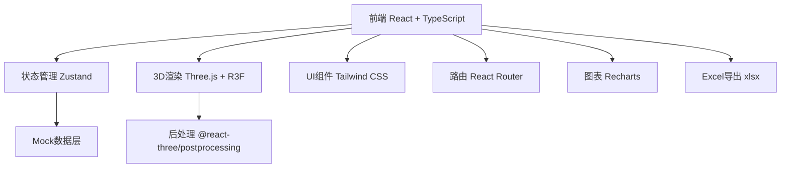
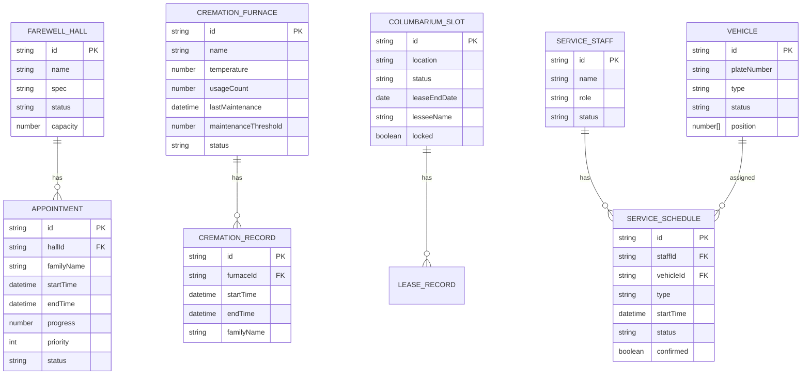

## 1. 架构设计



## 2. 技术选型说明

- **前端框架**: React 18 + TypeScript + Vite
- **3D渲染**: Three.js + @react-three/fiber + @react-three/drei + @react-three/postprocessing
- **状态管理**: Zustand
- **样式方案**: Tailwind CSS 3
- **路由**: React Router DOM
- **图表库**: Recharts
- **Excel导出**: xlsx (SheetJS)
- **图标**: Lucide React
- **后端**: 无，使用Mock数据进行前端演示

## 3. 路由定义

| 路由 | 页面用途 |
|------|----------|
| / | 3D全景总览 + 调度中心（首页） |
| /farewell | 告别厅管理 |
| /cremation | 火化车间监控 |
| /columbarium | 骨灰寄存管理 |
| /services | 治丧服务调度 |
| /reports | 数据统计与报表导出 |

## 4. 数据模型

### 4.1 数据模型定义 (ER图)



### 4.2 Mock数据定义

使用TypeScript接口定义数据结构，在store中初始化Mock数据模拟实时状态更新。

## 5. 项目结构

```
src/
├── components/
│   ├── 3d/               # 3D场景组件
│   │   ├── Scene3D.tsx       # 3D主场景容器
│   │   ├── FarewellHall3D.tsx # 告别厅3D模型
│   │   ├── CremationFurnace3D.tsx # 火化炉3D模型
│   │   ├── Columbarium3D.tsx # 骨灰寄存3D模型
│   │   └── Vehicle3D.tsx     # 车辆3D模型
│   ├── layout/           # 布局组件
│   │   ├── Header.tsx        # 顶部导航
│   │   ├── Sidebar.tsx       # 侧边栏
│   │   └── DataPanel.tsx     # 数据面板
│   ├── farewell/         # 告别厅组件
│   ├── cremation/        # 火化车间组件
│   ├── columbarium/      # 骨灰寄存组件
│   ├── services/         # 服务调度组件
│   └── reports/          # 报表组件
├── pages/
│   ├── Overview.tsx         # 全景总览页
│   ├── Farewell.tsx         # 告别厅页
│   ├── Cremation.tsx        # 火化车间页
│   ├── Columbarium.tsx      # 骨灰寄存页
│   ├── Services.tsx         # 服务调度页
│   └── Reports.tsx          # 报表页
├── store/
│   └── useAppStore.ts       # Zustand全局状态
├── types/
│   └── index.ts             # TypeScript类型定义
├── utils/
│   ├── mockData.ts          # Mock数据生成
│   └── excelExport.ts       # Excel导出工具
├── App.tsx
├── main.tsx
└── index.css
```
